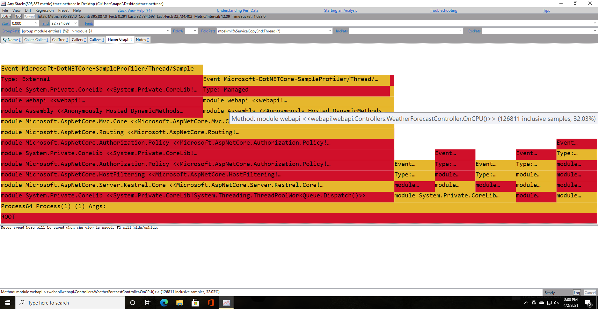

# Learning .NET Diagnostics on Linux <!-- omit in toc --> 

This repository has some of the stuff I've learned about .NET diagnostics on Linux.

# Table of Contents <!-- omit in toc --> 

- [Using dotnet tooling on containers: dotnet-counters, dotnet-dump, dotnet-trace](#using-dotnet-tooling-on-containers-dotnet-counters-dotnet-dump-dotnet-trace)
- [CPU Profiling](#cpu-profiling)
  - [dotnet-trace](#dotnet-trace)
  - [perf](#perf)
    - [Running perf on a container](#running-perf-on-a-container)
    - [Recording a CPU profiling](#recording-a-cpu-profiling)
    - [JIT Symbols](#jit-symbols)
    - [.NET runtime symbols](#net-runtime-symbols)
    - [Sidecar profiling container and symbols](#sidecar-profiling-container-and-symbols)
    - [dotnet-trace vs perf for CPU profiling](#dotnet-trace-vs-perf-for-cpu-profiling)
  - [Using this repository's helpers](#using-this-repositorys-helpers)
    - [Examples](#examples)

# Using dotnet tooling on containers: dotnet-counters, dotnet-dump, dotnet-trace

This section is based on Jeppe Andersen's
[".NET Core Diagnostics Tools and Containers"](https://www.nocture.dk/2020/06/17/dotnetcore-diagnostics-tools-and-containers/)
blog post.

The .NET runtime exposes diagnostics data through
[EventPipes](https://docs.microsoft.com/en-us/dotnet/core/diagnostics/eventpipe). The data on `EventPipes` is written to
a Unix Domain Socket created at `/tmp` and can be read by other processes (the socket name includes the PID of the .NET
process - `dotnet-diagnostic-1-473510-socket` - in this case the PID was 1):

```
root@1bed95a808ae:/tmp# ls -l
total 3116
srw------- 1 root root       0 Apr  4 12:46 dotnet-diagnostic-1-473510-socket
...
```

The .NET diagnostics tooling, `dotnet-counters`, `dotnet-trace`, rely on this socket to read diagnostic data from the
target process.

Now, when we have a containerized application and we want to use this tooling on the host or on a sidecar container, we
have to ensure that the diagnostics socket can be accessed by those tools. One solution for this is creating a bind
mount of `/tmp` when the application container is started, for example:

```
docker run --mount type=bind,source=/tmp,target=/tmp application-image:latest
```

This way the diagnostics socket will be created on the host's `/tmp`. .NET tooling used on the host will be able to
access the socket and, if we use a sidecar container for diagnostics we can do the following:
```
docker run -it \
  --pid=container:$CONTAINER_ID \
  --mount type=bind,source=/tmp,target=/tmp \
  --privileged \
   tiagonapoli/dotnet5.0-profiling-sidecar
```

- `--mount type=bind,source=/tmp,target=/tmp`: The container's `/tmp` will be mounted on the host's `/tmp`, which is
  where our containerized app will create the diagnostics socket.
- `--pid=container:$CONTAINER_ID`: `$CONTAINER_ID` is the ID of our app's container. This argument will join the
  profiling sidecar's PID namespace with the application container's PID namespace. This way we'll be able to see the
  processes running on our app container.
- `--privileged`: I didn't mention earlier, but `dotnet-dump` needs some special permissions to be able to run - when
  running under a container it requires the `SYS_PTRACE` capability, se we have to run the container with the argument
  `--cap-add=SYS_PTRACE` or `--privileged`. See
  [Dump collection and analysis utility (dotnet-dump)](https://github.com/dotnet/diagnostics/blob/main/documentation/dotnet-dump-instructions.md).

That's it, here's a session example:

- Starting the app container:
```
docker run -it \
    --rm \
    --mount type=bind,source=/tmp,target=/tmp \ # Mount the host's /tmp onto the container's /tmp
    -p 5000:80 \
    dotnet-profiling-webapi-example:debian
```

The app container was assigned the ID 522b56ed84d9.

- Starting the tooling sidecar:

```
tiagonapoli@tiagonapoli-desktop:~/Documents/tmp/dotnet-profiling/profiling-sidecar$ docker run -it \
    --rm \
    --privileged \
    --pid=container:522b56ed84d9 \ # 522b56ed84d9 is the container running the .NET app
    --mount type=bind,source=/tmp,target=/tmp \
    tiagonapoli/dotnet5.0-profiling-sidecar:kernel-v5.8.1

root@5667b6f624e9:/workspace# ls /tmp/dotnet-* # The bind mount allow this container to see 522b56ed84d9's /tmp/dotnet-diagnostic-1-692737-socket

root@5667b6f624e9:/workspace# ps -ax # Thanks to --pid=container:522b56ed84d9 we can see all processes from 522b56ed84d9
    PID TTY      STAT   TIME COMMAND
      1 pts/0    Ssl+   0:00 dotnet webapi.dll
     44 pts/0    Ss     0:00 /bin/bash
     53 pts/0    R+     0:00 ps -ax

root@5667b6f624e9:/workspace# dotnet-trace collect -p 1 # Collect events from PID 1
No profile or providers specified, defaulting to trace profile 'cpu-sampling'

Provider Name                           Keywords            Level               Enabled By
Microsoft-DotNETCore-SampleProfiler     0x0000F00000000000  Informational(4)    --profile 
Microsoft-Windows-DotNETRuntime         0x00000014C14FCCBD  Informational(4)    --profile 

Process        : /usr/share/dotnet/dotnet
Output File    : /workspace/trace.nettrace

[00:00:00:07]	Recording trace 1.9288   (MB)
Press <Enter> or <Ctrl+C> to exit...
```


# CPU Profiling

## dotnet-trace

.NET diagnostics team is doing an amazing job creating tooling for .NET on Linux. One of the tools they created is the
`dotnet-trace` tool, which collects tracing events generated by .NET applications (when I mention .NET I'm referring to
.NET Core and .NET 5). When I was looking for CPU profiling on .NET for Linux I found some tutorials and docs on a
interesting event provider - `Microsoft-DotNETCore-SampleProfiler`. According to
[the official docs](https://docs.microsoft.com/en-us/dotnet/core/diagnostics/well-known-event-providers#microsoft-dotnetcore-sampleprofiler-provider):

> This provider is a .NET runtime event provider that is used for CPU sampling for managed callstacks. When enabled, it
> captures a snapshot of each thread's managed callstack every 10 milliseconds. To enable this capture, you must specify
> an EventLevel of Informational or higher

So `dotnet-trace` + `Microsoft-DotNETCore-SampleProfiler` can give us CPU stacks sampling with which we can analyze
where our application is using CPU, amazing! And using `dotnet-trace` is really simple, I'll talk about it later.

However, in the first data collections I did, I found that some stacks were pretty time consuming, and they appeared to
be "idle" code paths - code paths leading to waits, sleeps, etc.

With that in mind I'll just stray from the main subject for a moment and talk about `on-cpu` and `off-cpu` profiling.
According to Brendan Gregg, on his `Off-CPU Analysis` [blog post](http://www.brendangregg.com/offcpuanalysis.html):

> Performance issues can be categorized into one of two types:
>
> On-CPU: where threads are spending time running on-CPU.
> Off-CPU: where time is spent waiting while blocked on I/O, locks, timers, paging/swapping, etc.

Sometimes it's interesting to do an off-cpu profiling (I think, I've never done one yet, like I said, I'm not expert,
and actually I a newbie), but what I was looking for was a on-cpu profiling. I wanted to know exclusively which stacks
were taking most CPU time.

Now, back to our main subject. So, could be that `dotnet-trace` + `Microsoft-DotNETCore-SampleProfiler` records off cpu
stacks as well? The documentation doesn't mention this specifically, but I suspected this. I made, then, an experiment
to check this:

I created a simple app with a route that consumed 100ms off cpu (`Task.Delay(100).Wait()`) and another route that
consumed 100ms on cpu. Then I started a `dotnet-trace` collection while sending http requests to both routes using 5
concurrent connections for each one.

The results were:

<p float="left">
  
   
</p>

Turns out that both routes, the one with on cpu workload and the one with the off cpu workload, had roughly the same
amount of samples captured. So, I think it's safe to assume the CPU samples events from
`Microsoft-DotNETCore-SampleProfiler` doesn't differ on-cpu workload from off-cpu workload when collecting, and then we
could do `off-cpu` analysis with it (if only `on-cpu` stacks were considered than the `off-cpu` code path would have a
negligible amount of samples).

## perf

`perf` is a powerful profiling tool that can record, among other things, sampling of stacks on CPU.

There's lots of amazing articles about it. Particularly I learned A LOT from Brendan Gregg's blog:
- [perf Examples](http://www.brendangregg.com/perf.html)
- [Flamegraphs](http://www.brendangregg.com/flamegraphs.html)

But I didn't know anything about profiling .NET using `perf`, and then I found this amazing presentation:
- [Debugging and Profiling .NET Core Apps on Linux - Sasha Goldshtein](https://www.youtube.com/watch?v=Jw88UYVG9dg)

Sasha Goldshtein uses `perf` to capture on-CPU stacks of .NET applications, and talks about the steps that you need to take for this to work properly. I wanted to try this on my own, and also understand a bit more about the prerequisites - I'll talk about them on the course of this section.

Also, a little bit later I found that the .NET diagnostics team has a solution for on CPU profiling which uses `perf` as
well: [perfcollect](https://aka.ms/perfcollect). I learned a lot studying this script. There's also docs on
[performance tracing on Linux](https://github.com/dotnet/runtime/blob/main/docs/project/linux-performance-tracing.md),
which I definitely recommend.

### Running perf on a container

Containers are a type of virtualization built on top of the host's kernel - all containers share the same kernel, the
host's. The `perf` tool is a tool from the Linux kernel, ideally if we want to use it on a container we should try to
match the host's kernel version with `perf`'s version. We can do that by building `perf` from source - this
[video](https://www.youtube.com/watch?v=Q-yO4md-pOo&t=8s) explains a nice way of doing that, and Marcel Dempers, the
same from the video, has a [repository](https://github.com/marcel-dempers/my-desktop/tree/master/dockerfiles/perf) with
dockerfiles to achive this. Some of the work on this repo's [profiling-sidecar](/profiling-sidecar) was based on his
work.

Also, running `perf` inside a container require that container to be privileged. On Docker we just have to add a
`--privileged` argument to `docker run` (I didn't check if this requirement is indeed necessary, but probably is).

### Recording a CPU profiling

Using `perf` we can record stack traces of functions on CPU by using the following command:

```
# Sample on CPU stack traces for the PID, at 99 Hertz, for 10 seconds:
perf record -F 99 -p $Pid -g -- sleep 10
```

This will generate a file `perf.data`, which can then be visualized using `perf report`. The following image shows the `perf report` of a .NET application profiling:

<p float="left">
  
</p>

Notice the `Symbols` collumn, some of them are just hex numbers, particularly the ones from `libcoreclr.so` shared
object, and `[JIT] tid 1`. Some have readable names, the ones from `[kernel.kallsyms]` for example.

`perf` records memory addresses profiled, that's why in the previous section we saw lots os hex numbers. `perf report`
and `perf script` (which creates a file we can send to other machines and analyze) "bind" these hex numbers, memory
addresses, to symbols, allowing us to make sense out of the data collected. The next sections will explain how to get
symbols for .NET.

For more complete information check [Brendan Gregg's post on perf](http://www.brendangregg.com/perf.html).

### JIT Symbols

Languages with JIT compilation will create `memory address <-> symbol` bindings during runtime. In order for
`perf report`/`perf script` to show symbols for jitted functions it would have to know these bindings. Turns out there's
a convention for that: runtimes with JIT should maintain a file at `/tmp/perf-PID.map` with these bindings. `perf` will
automatically consider this file to resolve memory addresses.

Now, if we want to resolve JIT symbols on .NET it's simple, we just have to initialize our application with the
following environment variable set:
```
COMPlus_PerfMapEnabled=1
```
We can add it to our app's Dockerfile for simplicity:
```
ENV COMPlus_PerfMapEnabled=1
```

This env variable will configure the runtime to create the `/tmp/perf-PID.map` file, which `perf` will use to resolve
symbols. Check out the difference on `perf report`:

<p float="left">
  
</p>

Now we have symbols for `[JIT] tid 1`! We don't have symbols for `libcoreclr.so` though - and that's because the CoreCLR
is compiled beforehand, it's not jitted. We'll see in the next section how we can get symbols for it.

There's another cool functionality `perf` has - with enough debug information it can map functions to source code lines.
The `/tmp/perf-PID.map` doesn't provide enough information for that though - another convention was created, the
`jitdump` file to provide this info. According to the
[specification](https://github.com/torvalds/linux/blob/master/tools/perf/Documentation/jitdump-specification.txt):

> The file is generated by Just-In-time compiler runtimes to save meta-data information about the generated code, such as address, size, and name of generated functions, the native code generated, the source line information. The data may then be used by performance tools, such as Linux perf to generate function and assembly level profiles.

So the jit dump would be necessary if we would like to know from which source code line a symbol was generated, which
can be useful. .NET already creates a jit dump file, at `/tmp/jit-PID.dump`, however it doesn't have source code
information yet (the jitdump specification states that this is optional). There's an open issue on dotnet runtime's repo
to add this functionality to .NET:
[Extend Linux perf jitdump functionality](https://github.com/dotnet/runtime/issues/13540).

For more information check: [Brendan Gregg's post on perf](http://www.brendangregg.com/perf.html),
[dotnet's linux performance tracing](https://github.com/dotnet/runtime/blob/main/docs/project/linux-performance-tracing.md).

### .NET runtime symbols

The .NET runtime libraries, like `libcoreclr.so`, don't have their symbols included on their files, we have to download
their debug files, which have the `memory address <-> symbol` mapping. Usually these libraries are located at `/usr/share/dotnet/shared/Microsoft.NETCore.App/$DOTNET_VERSION/`:
```
root@b6475e484f61:/app# ls /usr/share/dotnet/shared/Microsoft.NETCore.App/5.0.4/
System.Buffers.dll
System.Collections.Concurrent.dll
System.Collections.Immutable.dll
System.Collections.NonGeneric.dll
System.Collections.Specialized.dll
System.Collections.dll
System.ComponentModel.dll
System.Configuration.dll
...
libSystem.Net.Security.Native.so
libSystem.Security.Cryptography.Native.OpenSsl.a
libSystem.Security.Cryptography.Native.OpenSsl.so
libclrjit.so
libcoreclr.so
...
```


One way that `perf` tries to resolve symbols for `libcoreclr.so` is checking if `libcoreclr.so.dbg` exists alongside it,
or is located at `/usr/lib/debug/LIB_CORECLR_ABSOLUTE_PATH.dbg` ->
`/usr/share/dotnet/shared/Microsoft.NETCore.App/$DOTNET_VERSION/libcoreclr.so.dbg`. If `perf record`, `perf script` find
`libcoreclr.so.dbg` it will use it to resolve symbols.

Now, how we get those symbols? There's a dotnet tool that helps with that:
[dotnet-symbol](https://github.com/dotnet/symstore/tree/main/src/dotnet-symbol). We can download `libcoreclr.so.dbg` and
place it on `/usr/lib/debug/usr/share/dotnet/shared/Microsoft.NETCore.App/$NETCORE_VERSION` using the command:
```
dotnet-symbol --symbols --output /usr/lib/debug/usr/share/dotnet/shared/Microsoft.NETCore.App/$NETCORE_VERSION /usr/share/dotnet/shared/Microsoft.NETCore.App/$NETCORE_VERSION/libcoreclr.so
```

Now `perf record` and `perf script` will be able to resolve `libcoreclr.so` symbols:

<p float="left">
  
</p>


### Sidecar profiling container and symbols

If we opt to use a sidecar container to profile another container's application there are some things we need to ensure
in order to get it right:

- In order to resolve JIT symbols the `/tmp` of the target container has to be mounted on the profiling container (the
  `tmp/perf-PID.map` has to be accessible on the sidecar container).
- The sidecar has to join the target container's PID namespace (`--pid=container:$TARGET_CONTAINER_ID`).
- The container has to be `privileged` (`--privileged`).
- If we want `perf` to resolve `libcoreclr.so` symbols, we need to download the symbols on the target container - `perf`
  apparently is aware of other container's filesystems when resolving those symbols (I tried to copy those symbols on
  the sidecar container, but I wasn't able to get it to work).

So when starting a sidecar profiling container we should run something like:
```
docker run -it \
  --rm \
  --privileged \
  --pid=container:$TARGET_CONTAINER_ID \
  --mount type=bind,source=/tmp,target=/tmp \
   tiagonapoli/dotnet5.0-profiling-sidecar:kernel-$KERNEL_VERSION # Remember that perf ideally should match the host's kernel version
```

### dotnet-trace vs perf for CPU profiling

Earlier on this document a flamegraph was presented that showed that `dotnet-trace` recorded on cpu and off cpu stack
samples. We can do the same experiment using `perf` as profiler and conclude that `perf` only shows `on-cpu` stacks - I
had created a simple app with a route that consumed 100ms off cpu (`Task.Delay(100).Wait()`) and another route that
consumed 100ms on cpu. Then I started a `perf record` collection while sending http requests to both routes using 5
concurrent connections for each one. The result is shown on the following flamegraph:

<p float="left">
  
</p>

The stacks from the on-cpu route are majority, the off-cpu route barely shows.

Another difference is that `dotnet-trace` records stacks from managed threads and managed code. `perf`, a kernel level
tool, can record stacks from pretty much anything, even kernel stacks.

## Using this repository's helpers

This repo has a profiling sidecar image with some tooling and automations ready to use. The script at [/profiling-sidecar/start-profiling-container.sh](/profiling-sidecar/start-profiling-container.sh) will start a profiling container for a given container target:
```
Usage ./start-profiling-container.sh [OPT]
Options are:
  -c (ID): ID of the container with the process to profile
  -k (ARG): Kernel version of the 'perf' tool to be used
  -s: Add coreclr symbols to target container
  -h: Show this message
```

An usage example:
```
tiagonapoli@tiagonapoli-desktop:~/Documents/tmp/dotnet-profiling/profiling-sidecar$ ./start-profiling-container.sh -c 1cbe2c274fd3 -k v5.8.1
> Using perf from Linux's kernel v5.8.1...
> The container to be attached will be the following: 

CONTAINER ID   IMAGE                                    COMMAND               CREATED          STATUS          PORTS                  NAMES
1cbe2c274fd3   dotnet-profiling-webapi-example:debian   "dotnet webapi.dll"   44 minutes ago   Up 43 minutes   0.0.0.0:5000->80/tcp   dotnet-profiling-webapi-example-debian

> The following bind mounts will be created:
  HOST                 CONTAINER
- /tmp              -> /tmp
- ~/perf-profilings -> /workspace/profilings


root@b93357913eed:/workspace# 
```
Notice that the script craete the `~/perf-profilings -> /workspace/profilings` bind mount. Inside the container the
profiling files will be saved on `/workspace/profilings` - the bind mount will help us accessing those files.

Inside the container there's the `profcpu` command which we can execute (the source is [/profiling-sidecar/src/scripts/profcpu.sh](/profiling-sidecar/src/scripts/profcpu.sh), heavily inspired on .NET's `perfcollect`):
```
root@b93357913eed:/workspace# profcpu
ERROR: Not enough arguments have been specified.
./profcpu <action>
Valid Actions: collect postprocess

collect:
    Collect on CPU samples and create a flamegraph out of them.
    -pid          : ID of the process from which samples will be collected. Defaults to 1.
    -duration     : Collection duration. Defaults to 30 seconds.

postprocess:
    Post-process a previously collected perf data.
    -dir          : Directory containing collected data.

```

We can run:
```
root@9cd07c449f37:/workspace# profcpu collect -pid 1 -duration 10
> Starting 'perf record' of PID 1 with sampling frequency 99 Hz...
> Will record for 10 seconds...
[ perf record: Woken up 1 times to write data ]
[ perf record: Captured and wrote 0.046 MB perf.data (10 samples) ]
> Finished gathering data.

> Starting post process...
> Files will be saved at 'profilings/01-07-38_2021-04-05'

> Generating flamegraphs...
```

The script will record samples from PID 1 for 10 seconds and then will generate data we can visualize/analyze. The data
will be saved at `profilings/01-07-38_2021-04-05` and we can access this on the host at
`~/perf-profilings/01-07-38_2021-04-05`:
```
tiagonapoli@tiagonapoli-desktop:~/perf-profilings/01-05-39_2021-04-05$ ls ~/perf-profilings/01-07-38_2021-04-05
flamegraph.svg  folded_stacks.out  perf.data  perf_script.out  prof.tar.gz
```
We'll have the `flamegraph.svg` we can use to analyze the data, and the `prof.tar.gz`, which compresses all the files on
this directory and can be downloaded if we are doing profiling on a remote machine and want to do that analysis on your
machine. The flamegraph is generated with [Brendan Gregg's scripts](https://github.com/brendangregg/FlameGraph) and look
like this:

<p float="left">
  
</p>

Also, the `perf_script.out` can be visualized on [Netflix's Flamescope](https://github.com/Netflix/flamescope).

### Examples

This repository has a simple application you can use to do some dummy profilings. There are some flamegraphs you can
check out at [/web-api-example/flamegraph-examples](/web-api-example/flamegraph-examples). The profilings were done
using the profiling sidecar while benchmarking the application using a http benchmarking tool.